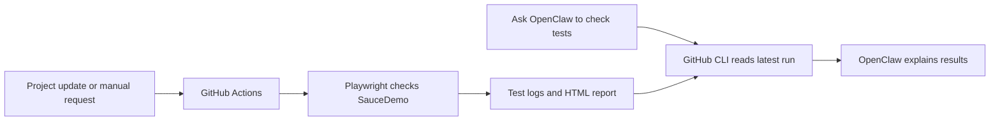

# AI Testing Helper with OpenClaw

[](https://github.com/ambatiroshan7-source/ai-testing-helper/actions/workflows/tests.yml)

A beginner-friendly project that checks a sample online store automatically and lets a self-hosted OpenClaw assistant explain the results in everyday language.

## Why I built this

I wanted to learn how to build an AI testing helper from the basics, without already owning an application or managing a server. This project connects browser testing, GitHub automation, and an AI assistant in a working example.

It uses [SauceDemo](https://www.saucedemo.com/), a Sauce Labs sample store, to practice a workflow that can later be adapted to an application I own or have permission to test.

## What problem does it solve?

Manually checking login, adding products, verifying the cart, and logging out takes repeated effort. It is easy to forget a check, and test logs can be difficult for a beginner to interpret.

This helper saves those checks as repeatable tests. GitHub runs them when this project changes, keeps the results, and produces a report. OpenClaw retrieves the latest result when asked and explains what passed, failed, or was blocked.

The goal is less repeated manual work and clearer test evidence. Passing these checks does not guarantee that the whole website is bug-free.

## How it works



Playwright performs the browser checks and decides pass/fail through assertions. GitHub Actions runs them on a hosted Linux machine. OpenClaw reads the evidence and explains it in chat.

## What is tested

| Test | Verified behavior |
| --- | --- |
| Store flow | Valid login opens six products; adding a backpack updates the cart; the cart contains the correct name, quantity, and price; removal empties it; logout returns to the login form. |
| Incorrect password | Login is rejected, an error appears, and the products page is not reached. |

Each test starts in a separate browser session. Tests use one worker and no retries. Failures retain screenshots and traces. Only public demo credentials are used: `standard_user` / `secret_sauce`. No real purchases are made.

## Current features

- Both automated tests have passed on GitHub, including a fresh manual run.
- Tests run on pushes to `main`, pull requests targeting `main`, and manual requests.
- GitHub saves HTML reports and available failure evidence for seven days.
- The owner's OpenClaw installation can read new GitHub results and save `reports/latest-github-tests.md`.
- Asking **“Check my GitHub tests”** retrieves existing results; it does not start a new run.

## Technology

| Tool | Purpose |
| --- | --- |
| Node.js 24 | Runs the project and integration script. |
| Playwright + Chromium | Browser checks, assertions, screenshots, and reports. |
| GitHub Actions | Runs tests without keeping the laptop on. |
| OpenClaw, self-hosted locally | Conversational assistant and testing skill. |
| GitHub CLI (`gh`) | Authenticated access to private repository results. |

## Run tests on your computer

Install Node.js 24 and Git, then run:

```sh
git clone https://github.com/ambatiroshan7-source/ai-testing-helper.git
cd ai-testing-helper
npm ci
npx playwright install chromium
npm test
```

This repository is private; cloning requires an authorized GitHub account. On Linux, use `npx playwright install --with-deps chromium` to install browser system dependencies too.

Open the report after a run:

```sh
npm run report
```

## Run tests on GitHub

1. Open **Actions** in this repository.
2. Select **Store tests**.
3. Select **Run workflow**, keep `main` selected, and confirm.
4. Wait for the run to finish, then open it to read the test logs.
5. Download **store-test-report** from the run's artifacts to inspect the report and failure evidence.

Extract the downloaded report, then run `npx playwright show-report /path/to/playwright-report` from the project folder to view it.

Workflow failures can come from installation or network problems. Inspect the failed step before concluding that a website check failed.

## Connect OpenClaw to GitHub results

Tests run independently of the AI assistant. On another machine:

1. Install OpenClaw and configure an AI connection.
2. Install [GitHub CLI](https://cli.github.com/) and Node.js. Ensure `gh` and `node` are available to OpenClaw.
3. Run `gh auth login` with an account that can read this repository.
4. From this project folder, install the included skill:

```sh
mkdir -p ~/.openclaw/workspace/skills/github-test-results
cp integrations/openclaw/SKILL.md integrations/openclaw/check-github-tests.cjs ~/.openclaw/workspace/skills/github-test-results/
openclaw skills info github-test-results
```

Test retrieval directly:

```sh
node ~/.openclaw/workspace/skills/github-test-results/check-github-tests.cjs
```

Then tell OpenClaw: **“Check my GitHub tests and explain the results in simple words.”** Start a new chat if an existing session has not picked up the skill.

The script reads the latest main-branch `tests.yml` run, includes its commit and link, and saves the test-step evidence. Pending runs stay pending; retrieval errors are reported as blocked. The skill does not change code, rerun tests, or post comments.

Optional environment variables: `TEST_REPOSITORY` selects another owner/repository with the same workflow filename; `GH_BINARY` selects the GitHub CLI executable; `OPENCLAW_WORKSPACE` selects the report workspace. Standard GitHub CLI authentication settings also apply. For a custom workspace, put the skill in its `skills/github-test-results` folder and adjust the command in `SKILL.md`.

## Project files

```text
.github/workflows/tests.yml                  GitHub automation
tests/store.spec.js                         Browser checks
playwright.config.js                       Test and report settings
package.json / package-lock.json            Dependencies and commands
integrations/openclaw/SKILL.md              Assistant instructions
integrations/openclaw/check-github-tests.cjs  Result retrieval
```

## Scope and limitations

This is a learning project targeting an external demo website. Updates to this repository trigger checks against that site; it is not connected to SauceDemo's deployment pipeline. Changes or outages on SauceDemo can affect results.

GitHub tests work while the laptop is off. OpenClaw's report explanation needs the configured laptop, GitHub authentication, and AI connection. Reports are fetched when requested. Automatic notifications, scheduled monitoring, and VPS deployment are not configured.

Checkout, accessibility, performance, security, and other browsers are not covered yet. The helper does not automatically fix or deploy code.

Personal API keys and GitHub tokens must stay outside the repository. The integration uses GitHub CLI authentication. Review screenshots and traces before sharing reports from future tests of private applications.

## Next improvements

- Add checkout and more input-validation checks.
- Connect an owned application's staging environment and deployment workflow.
- Add browser coverage and accessibility checks.
- Add failure notifications or move OpenClaw to an always-on VPS when needed.

## References

- [Playwright GitHub Actions guide](https://playwright.dev/docs/ci-intro)
- [OpenClaw documentation](https://docs.openclaw.ai/)
- [Sauce Labs sample application](https://github.com/saucelabs/sample-app-web)
